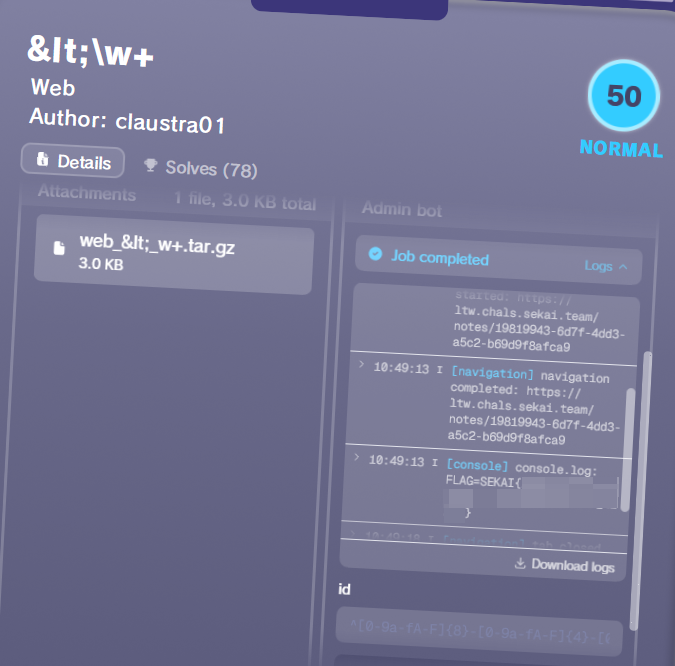
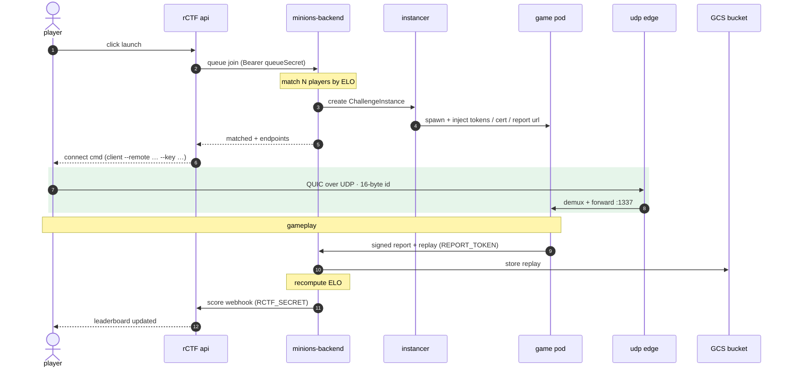

import { Image } from 'astro:assets'
import LatencyTable from '../../../components/charts/LatencyTable.astro'
import LineChart from '../../../components/charts/LineChart.astro'
import DiscordChat from '../../../components/discord/DiscordChat.astro'
import DiscordMessage from '../../../components/discord/DiscordMessage.astro'
import GmailMessage from '../../../components/gmail/GmailMessage.astro'
import Receipt from '../../../components/Receipt.astro'
import Tooltip from '../../../components/Tooltip.astro'
import { ROWS } from './anycast'
import * as bc from './blockchain'
import * as nodes from './cluster-nodes'
import * as fleet from './fleet-metrics'
import * as inst from './instances'
import { CPU, EVENTS, RANGE, STEP, T0 } from './metrics'
import badgeLocc from './pics/badge-locc.png'
import badgePjsk from './pics/badge-pjsk.png'
import discordMeme from './pics/discord-meme.png'
import discordSpecs from './pics/discord-specs.png'

Last weekend we hosted [SekaiCTF 2026](https://ctftime.org/event/3113), the fifth edition of our <Tooltip link='https://ctftime.org/ctf-wtf/'>CTF</Tooltip>

This year I was the only person who was in charge of the platform/infrastructure side of things, while also authored two challenges (which I am not going to be talking about here)

For all the previous years we were using a slightly outdated platform, slightly outdated infrastructure, slightly outdated everything.
That's why for this year I reworked everything from the ground up, and we even built a new [platform](https://github.com/otter-sec/rctf-new) _(the repo is not public yet)_ along the way

# Platform

Obviously, the first things players notice is our new beautiful platform, which is a rewritten version of rCTF with a new custom theme that a good friend of mine [enscribe](https://github.com/jktrn) _(and Devin)_ made

## Backend

The backend was rewritten from scratch, to preserve compatibility we kept the v1 api layer and just added a v2 layer on top of it

The tech stack is:

- Typescript (Bun) with Hono
- Postgres / Redis for the databases
- Native kubernetes operator for the instancer (with a more lightweight docker alternative)

There is not much to talk about the platform honestly, it just.. works. And does so without consuming a ton of CPU/Memory like CTFd does

We were hosting the platform instance on a hetzner vps with **the databases hosted in the same compose stack**.
Here is the cpu usage graph to give you an idea how lightweight everything is (keep in mind, SekaiCTF is a _very_ popular CTF event)

<LineChart
  title='CPU usage (%) / platform + databases'
  data={CPU}
  events={EVENTS}
  domain={RANGE}
  t0={T0}
  step={STEP}
  agg='peak'
  yMax={300}
  yFormat={v => String(v)}
/>

For reference, for all the previous years we hosted, we were using CTFd with a custom theme.
And during all previous years, except for 2025, we were experiencing one _very_ annoying issue, which is the platform going down during the start of the CTF, because CTFd is horrible with the resource usage.
It's especially funny, because every year we were increasing the specs but it was never enough.
In 2025, though, we overprovisioned to the absolute limits and it was the first year when we didn't go down during the first minutes of the CTF (unfortunately the metrics were lost)

<DiscordChat>
  <DiscordMessage
    time='3:11 AM'
    user='hfz'
    color='#2ecc71'
    badge='LOCC'
    badgeIcon={badgeLocc.src}
    fullTime='August 15, 2025 03:11 AM'>
    <Image src={discordSpecs} alt='e2-highcpu-32 cloud specs' />
  </DiscordMessage>
  <DiscordMessage
    time='3:11 AM'
    user='hfz'
    color='#2ecc71'
    badge='LOCC'
    badgeIcon={badgeLocc.src}
    cont
    fullTime='August 15, 2025 03:11 AM'>
    <Image src={discordMeme} alt='we are back' />
  </DiscordMessage>
  <DiscordMessage
    time='3:11 AM'
    user='hfz'
    color='#2ecc71'
    badge='LOCC'
    badgeIcon={badgeLocc.src}
    cont
    fullTime='August 15, 2025 03:11 AM'>
    we are back
  </DiscordMessage>
  <DiscordMessage
    time='3:11 AM'
    user='es3n1n'
    color='#2ecc71'
    badge='PJSK'
    badgeIcon={badgePjsk.src}
    fullTime='August 15, 2025 03:11 AM'>
    HAHA
  </DiscordMessage>
</DiscordChat>

# Infrastructure

## Cloud

As usual, Google Cloud Platform was sponsoring our event by giving us $500 worth of credits.
The entirety of our cloud infrastructure was located in <Tooltip text="St. Ghislain, Belgium">`europe-west1`</Tooltip>

We were running everything in a brand new gcp project and a new billing account.
This, unfortunately, resulted in me going through the GCP Sales chats back2back for a while until someone from the GCP CTF Sponsorship team helped me with getting our billing account trust increased

I am very thankful to them and here's the email I sent them after the CTF when they reached out to ask how everything went:

<GmailMessage
  name='Arsenii Esenin'
  email='loremipsum@gmail.com'
  blurUser
  recipients={[{ name: 'Loremipsum', blur: true }, { name: 'CTF' }]}
  date='2026-06-29T16:00:00Z'
  avatarColor='#e8633a'>
  Hey!

~ omitted text ~

Thank you for your help :)

I've never seen GCP quota default to 3000 N2 CPUs before, \
 Arsenii

</GmailMessage>

Having a billing acount with a _really_ good reputation is truly an experience of a lifetime

## Networking

### Anycast

This year, we started <Tooltip link="https://en.wikipedia.org/wiki/Anycast">anycasting</Tooltip> to reduce the latency for our Asian/American players

This, unfortunately, is not a magic thing that will get you a 20ms ping from Asia to the European server, but we probably will still keep anycast, the TCP/TLS handshake terminates on a nearby Google edge instead of doing every round-trip to Belgium, even the far-away players never actually complained

Here's the full request round-trip (client all the way to our backend and back) by region.
Every challenge backend lives in `europe-west1`, so the latency mostly tracks the distance to Belgium:

<LatencyTable rows={ROWS} />

_There were ~47M requests from China, but the geo/latency data is all over the place (courtesy of the Great Firewall), so I left it off the map rather than show a number I don't believe_

#### Routing

The thing is that while for HTTPs challenges we can just route based on the `Host` header, we unfortunately can't do this for the TCP challenges because there's nothing to match for

The usual solution for this (and what we used to be doing before, although without the global anycast ips) is to add the SSL terminating on the proxy and route based on the <Tooltip link="https://en.wikipedia.org/wiki/Server_Name_Indication">SNI</Tooltip>.
What I don't like about this, is that as an outcome, instead of connecting via `nc challenge.chals.sekai.team 1337`, people need to do `ncat --ssl challenge.sekai.team 1337`.
It's honestly a very minor thing and does not matter much in practice, but some of the new players are getting confused by this

The second solution is to just allocate random ports for the instances and have one single ip for this, but I want my instances to all be on the port 1337!

So the third solution, what we've done, is to just allocate one ip address per instance.
This is not ideal, and also pricey, but at the same time we're not the ones who are paying for the infra, so since we got free $500 from google, might as well spend everything in a single weekend

## Kubernetes

### Shared challenges cluster (+ some miscellaneous stuff)

The `sekaictf-infra` cluster consisted of two node pools:

- challenge pool: running 1 to 5 <Tooltip text="8 vCPU, 32GiB">`e2-standard-8`</Tooltip> nodes per zone (challenges only)
- infra pool: running 1 to 4 <Tooltip text="4 vCPU, 16GiB">`e2-standard-4`</Tooltip> nodes per zone (kubernetes default workloads, our operator)

#### Our lovely custom kubernetes operator

For shared challenge instances I wrote my own kubernetes operator that was creating the workloads by itself from one simple <Tooltip text="Custom Resource">CR</Tooltip> to avoid any complex setups or manual configs per challenge:

```yaml
apiVersion: sctf.es3n1n.io/v1alpha1
kind: Challenge
metadata:
  name: mikuprotect
  namespace: mikuprotect
spec:
  releaseTime: "2026-06-27T08:00:00Z"
  pods:
    - name: challenge
      replicas: 3
      automountServiceAccountToken: false
      egress: true # allow outbound internet access (default: false)
      spec:
        containers:
          - name: challenge
            image: "sekaictf-2026-challenges/mikuprotect:latest"
            env:
              - name: JAIL_ENV_FLAG
                value: "SEKAI{flag}"
            ports:
              - containerPort: 5000
            resources:
              requests: { cpu: 500m, memory: 512Mi }
              limits: { cpu: 1, memory: 1Gi }
            securityContext:
              privileged: true
    exposed:
      - protocol: TCP  # https/tcp
        subdomain: "{{ challenges[0].name | lower }}"
        port: 1337
        targetPort: 5000
        # adds the PROXY command for tcp endpoints (tcp only)
        proxyProtocol: true
        # do not terminate the connection on edge pops (no anycast)
        passthrough: false
```

The neat part is that this `Challenge` is the _only_ thing a challenge author ever writes. The operator reconciles everything around it: one `Deployment` per pod, a `Service` for anything exposed, every network policy, the DNS records, and the cloud load balancers. Nobody touches kubernetes/cloud stuff directly

##### Deployments

By default:

- every pod is pinned to the `challenges` node pool via a `nodeSelector` and toleration, so challenge workloads never share a node with the operator, gateways or anything else important
- `automountServiceAccountToken` is forced to `false`
- DNS is swapped to `DNSNone` with `8.8.8.8`/`8.8.4.4`, so challenges can't enumerate cluster-internal DNS
- every container _must_ declare cpu/memory `requests` **and** `limits` or the operator rejects the whole thing

##### Network policies

Every challenge starts with a deny-all network policy and only gets the exact rules it asks for:

- `links` opens pod-to-pod traffic _inside_ a challenge
- `egress: true` lets a pod reach the public internet, but the private RFC1918 and metadata ranges are carved out, so a challenge can't reach the cluster network or hit the GCP metadata server
- `exposed` ports are reachable only from the cloud load balancer's source ranges, and only _after_ release
- `allowConnectTo` is a special case when the challenge needs to talk to another one across namespaces

So by default a challenge is a sealed box with no internet, no neighbors and no cluster access

##### Getting traffic in

The `exposed` block is where the cloud integration lives, and there are two protocols

`HTTPS` challenges get a

- One shared HTTPS LB, one shared cert (`*.chals.sekai.team`) for all HTTPS endpoints
- Gateway API `HTTPRoute` attached to our shared GKE gateway with the challenge's subdomain as the hostname
- Google Cloud load balancer that the GKE's gateway controller creates, plus a <Tooltip text="Network Endpoint Group - the set of pod IPs a Google load balancer sends traffic to">NEG</Tooltip> for it. The operator just adds an optional Cloud Armor `GCPBackendPolicy` to allow only specific ips while testing pre-ctf

For each `TCP` port the operator assembles the entire GCP load-balancer chain itself:

- a global static IP
- forwarding rule
- target TCP proxy
- backend service
- the pod's NEG

In case of a `passthrough` TCP challenge, the operator skips the managed proxy altogether and uses a plain, regional, `LoadBalancer` service with `externalTrafficPolicy: Local` to avoid terminating the connection at the loadbalancer and pass it directly to the challenge

In every case the operator creates an `A` record into Cloud DNS for `{subdomain}.{base-domain}` pointing at whichever IP was allocated, on a short TTL

##### Release scheduling

Every challenge goes live at the same instant, and to avoid cold-starting all of our load balancers the moment the CTF opens (because this takes up to 10 minutes), operator pre-provisions them.
The lifecycle is split into two parts:

- at `releaseTime` minus a lead time (15 minutes by default) it builds _everything_ (deployments, services, DNS, the full cloud LB chain, etc)
- at `releaseTime` it flips the network policies open and players get in

As a result, the challenge become accessible in _milliseconds_ past the release time

#### Adminbot

As part of the rCTF rewrite, we also rewrote the adminbot. The configs for the adminbots are now stored on the _platform_ and are available to the players directly from the platform.
In the future, when we publish the repo with the platform, we will also make an npm package that you can use for this adminbot to test things locally



One of the fun things we've done is hooking of various browser events and store logs that the participants can then see to avoid posting everything to webhooks, etc

Here is an example config that the adminbot uses and that the players can download from the platform:

```ts
import { sleep } from 'bun'
import { Challenge, type ChallengeContext } from '../src/types'

const APP_URL = `https://ltw.chals.sekai.team`

export const challenge = new Challenge({
  timeoutMilliseconds: 30_000,

  inputs: {
    id: {
      pattern:
        '^[0-9a-fA-F]{8}-[0-9a-fA-F]{4}-[0-9a-fA-F]{4}-[0-9a-fA-F]{4}-[0-9a-fA-F]{12}$',
    },
  },

  handler: async (ctx: ChallengeContext): Promise<void> => {
    const url = `${APP_URL}/notes/${ctx.input.id!}`
    ctx.output.info('challenge', `visiting note`, { url })

    await ctx.browserContext.setCookie({
      name: 'FLAG',
      value: ctx.job.flag,
      domain: APP_HOST,
      path: '/',
    })

    const page = await ctx.browserContext.newPage()

    try {
      await page.goto(url)
    } catch (e) {
      ctx.output.fatal('challenge', `failed to visit provided URL: ${e}`, {
        url,
      })
      return
    }

    await sleep(5_000)
    await page.close()
  },

  hooksConfig: {
    showConsoleLogs: true,
    showBrowserErrors: true,
    showNavigation: true,
    showDialogs: true,
    autoDismissDialogs: true,
    limitTabsNumber: -1,
    limitTabsNumberShowError: true,
  },

  browser: 'chrome',

  restrictDomains: {
    host: {
      allowRegex: [{ pattern: '^ltw\.chals\.sekai\.team$' }],
      disallowRegex: [{ pattern: '.*' }],
    },
  },
})
```

When you submit the adminbot job, it queues it up on the platform side, and the adminbot workers drain this queue and dispatch the actual runs

On the cluster side it's nothing fancy: one `Deployment` in its own namespace, sitting behind a plain L4 `LoadBalancer` on a dedicated static ip that the platform talks to over bearer auth.
The only interesting part is the scaling

I didn't want to scale the workers on cpu, since cpu tells you nothing about how backed up the queue actually is.
So the replica count is handed off to <Tooltip link="https://keda.sh">KEDA</Tooltip>. It polls the platform's queue-depth endpoint every 10 seconds and scales to keep it around 2 jobs per worker.
It's still a plain HPA though, KEDA just feeds it the queue depth instead of cpu. There's a min/max bound so it can't run away, plus a 5 minute scale-down window

#### Ethereum challenges

For the ethereum challenge deployments we were running [es3n1n/paradigmctf.py](https://github.com/es3n1n/paradigmctf.py) that spawns kubernetes workloads for every on-demand instance of the challenge for a team

The deployment is three things in a `blockchain` namespace: redis for instance state, an orchestrator, and an anvil proxy. When a team clicks deploy, the platform calls the orchestrator over its api, and it spins up a pod running [anvil](https://book.getfoundry.sh/anvil/), funds the accounts, runs the challenge's deploy script, and persist the state to redis

Those per-team anvil pods get the same default-deny treatment as everything else. They can't reach each other, can't hit the cloud metadata server or any private range, and only the orchestrator and api pods are allowed to talk to them

We had only 2 ethereum challenges and here's how many of those anvil instances were alive throughout the CTF:

<LineChart
  title='active ethereum instances'
  data={bc.INSTANCES}
  events={nodes.EVENTS}
  peak={bc.INSTANCES_PEAK}
  domain={nodes.RANGE}
  t0={nodes.T0}
  step={nodes.STEP}
  yMax={90}
  yFormat={v => String(v)}
/>

It's a fork of [paradigm's CTF infra](https://github.com/paradigmxyz/paradigm-ctf-infrastructure) with a few fixes on top. Unfortunately, the code quality of this project and architecture designs are somewhat poor, so in the future I am planning on fully rewriting it from scratch instead of trying to fix it. Though, I must admit, it does work pretty reliably

### Instancer cluster

The `instancer-infra` cluster consisted of two node pools:

- primary pool: running 2 to 32 <Tooltip text="8 vCPU, 32GiB">`n2-standard-8`</Tooltip> nodes per zone
- arm64 pool: running 1 to 8 <Tooltip text="AArch64, 8 vCPU, 32GiB">`c4a-standard-8`</Tooltip> nodes per zone

<LineChart
  title='instancer cluster nodes'
  data={nodes.INSTANCER}
  events={nodes.EVENTS}
  peak={nodes.INSTANCER_PEAK}
  domain={nodes.RANGE}
  t0={nodes.T0}
  step={nodes.STEP}
  yMax={50}
  yFormat={v => String(v)}
/>

Over the whole weekend the instancer spawned around 6,400 instances:

<LineChart
  title='active instances'
  data={inst.INSTANCES}
  events={nodes.EVENTS}
  peak={inst.INSTANCES_PEAK}
  domain={nodes.RANGE}
  t0={nodes.T0}
  step={nodes.STEP}
  yMax={250}
  yFormat={v => String(v)}
/>

#### One more custom kubernetes operator

For the instanced challenges we built a custom kubernetes operator that reconciles `ChallengeInstance` objects into workloads, traefik routing rules, network policies

```yaml
apiVersion: rctf-instancer.osec.io/v1
kind: ChallengeInstance
metadata:
  labels:
    app.kubernetes.io/name: rctf-instancer
    app.kubernetes.io/managed-by: kustomize
  name: challengeinstance-sample
spec:
  teamId: teamId
  challengeId: challengeId
  expiresAt: '2026-12-19T20:30:00Z'
  pods:
    - name: app
      egress: true
      ports:
        - protocol: TCP
          port: 3000
      spec:
        restartPolicy: Always
        terminationGracePeriodSeconds: 0
        automountServiceAccountToken: false
        enableServiceLinks: false
        containers:
          - name: app
            image: 'sekaictf-2026-challenges/pokemon-park:latest'
            ports:
              - containerPort: 3000
            resources:
              requests: { cpu: 100m, memory: 128Mi }
              limits: { cpu: 500m, memory: 512Mi }
            readinessProbe:
              tcpSocket: { port: 3000 }
              initialDelaySeconds: 5
              periodSeconds: 3
            securityContext:
              allowPrivilegeEscalation: false
              capabilities:
                drop: ['ALL']
  expose:
    - kind: https
      hostPrefix: pokemon-park
      containerName: app
      containerPort: 3000
```

##### Resources it creates

Each `ChallengeInstance` gets its own namespace (`inst-{challenge}-{team}`), and everything for it lives inside: one `Deployment` per pod (always a single replica, these are disposable), a `Service` each, the traefik routes, and the same default-deny network policies as the shared cluster. Deleting the `ChallengeInstance` drops the namespace, and everything else cascades out with it, so teardown is just deleting one object

Isolation is the same idea as before. One team's instance can't see another team's, can't reach the cluster network, and only gets internet egress if the pod opts in with `egress: true`

##### Per-instance hostnames

Every exposed port gets its own hostname: `{hostPrefix}-{12 hex}.instancer.sekai.team`, where the hex comes from the instance's UID

Everything under that is one wildcard too. A single `*.instancer.sekai.team` DNS record points at traefik's load balancer covers every subdomain. Traefik routes `http`/`https` off the `Host` header, and for tcp it does the same SNI trick from the networking section

##### VMs and weird architectures

The arm64 pool was needed for the single `pwn/MTE` challenge, and the x86 nodes also have nested virtualization (`/dev/kvm`) wired up via [squat/generic-device-plugin](https://github.com/squat/generic-device-plugin) for the android challenge that exposes the adb connection to the players (`misc/sekaiid`)

# CI/CD

Last year we had a `law-and-order` incident, where we didn't notice that the challenge attachments on the platform were outdated, this happened because they were being synced manually.
This year I fixed this by implementing our own CI/CD action that both pushed data to the platform, and deployed/updated the instances

The way its designed is that challenge lives in one big monorepo, one folder per challenge, grouped by category.
Inside a folder you get the source, a solution, and a `kona.yaml`.
This one file contains everything: the metadata players see (name, author, description, difficulty), the flag, which files to hand out, the image to build, and how the thing actually gets deployed

A static challenge just inlines the `Challenge` CRD from earlier (templated) right there in its `kona.yaml`, and an instanced one inlines the `ChallengeInstance` config.
So whoever wrote the challenge also writes, in the same file, exactly how it runs. Here's a trimmed example:

```yaml
# pwn/3in1/kona.yaml (trimmed)
challenges:
  - category: pwn
    name: 3in1
    author: Qyn
    flags:
      rctf: { file: challenge/flag.txt } # real flag, read from the source
    attachments:
      files: ['challenge/'] # hand out the whole folder
      exclude: ['challenge/flag.txt'] # ...except the real flag
      additional:
        - { path: flag.txt, strContent: 'SEKAI{dummy_flag}' } # ship a fake one instead
    endpoints:
      - {
          type: nc,
          endpoint: "{{ challenge.name | lower }}.{{ config.domains['static'] }}",
          port: 1337,
        }

deployment:
  images:
    - {
        path: challenge,
        name: '{{ challenges[0].name | lower }}',
        registryName: challenges,
      }
  kubernetesInlineManifests:
    - clusterName: main
      documents: [... the Challenge CRD, templated ...]
```

The tool is open source at [project-sekai-ctf/konata](https://github.com/project-sekai-ctf/konata). It can talk to both rCTF and CTFd

After that, deploying is just `git push`. A github action runs on every push to `main`, works out which challenges actually changed, and creates concurrent actions to process them.
Each one authenticates to GCP with workload identity, builds the image, pushes it to artifact registry, applies the manifest, and syncs the metadata

So from a challenge author's side the whole thing is: edit your folder, push, walk away. No `kubectl`, no logging into the platform

# Minions in 16k

A very special in the infrastructure way challenge to deploy was `game/Minions in 16k`.
This was a <Tooltip text="King of The Hill">KoTH</Tooltip> challenge where you had to write bots for a quake-like game to win against other players

This challenge had a fullblown matchmaking system with concurrent lobbies, ELO and everything else a "real" game has

Everything starts off with a platform integration (implemented as an instancer, they're all modular and you can run multiple instancer providers with rCTF v2), where the people are clicking on a button to "launch" an instance

Here's what happens after the press of this button

## The lobbies

First thing that happens is rCTF backend converts your "create" instance request to the minions-backend specific shape, pulls out some config values for the deployments and sends this request to the minions-backend\*.
The minions-backend after that is adding you to the queue of people that are searching for the game

Once there's more than N players of the same-ish elo looking for a game, it joins them into a game and starts the game

\* - The minions backend was implemented entirely by [@mixy1](https://x.com/_mixy1), the original author of this challenge

## The games

The minions backend is then sending a request to our k8s instancer, that creates a workload in a shape like this:

```yaml
pods:
  - name: app
    labels:
      ctf.sekai.team/minions: game-instance
      udprouter.es3n1n.io/instance-id: '000000000000000000000000'
    ports:
      - port: 1337
        protocol: UDP
    spec:
      containers:
        - name: app
          image: "{{ images['minions'] }}"
          args:
            - --bind
            - 0.0.0.0:1337
            - --replay-dir
            - /srv/minions/replays
            - --feature-flags
            - /srv/minions/config/feature_flags.toml
          resources:
            limits:
              cpu: 500m
              memory: 256Mi
            requests:
              cpu: 75m
              memory: 100Mi
      restartPolicy: Always
      terminationGracePeriodSeconds: 0
      automountServiceAccountToken: false
      enableServiceLinks: false
    egress: true
```

That yaml is only the base shape though. At spawn the backend injects the per-match bits into the server container: `PLAYER_TOKENS`, `MATCH_ID`, `REPORT_URL`/`REPORT_TOKEN`, a per-match WebTransport cert/key (`WT_CERT_DER_B64`/`WT_KEY_DER_B64`), and a `REPLAY_UPLOAD_URL`

Then, on the k8s instancer level I had to add one extra thing. For pods with a `udprouter.es3n1n.io/instance-id` label, allow ingress from the `udp-router` pod from the `udp-router` namespace

## Routing

Now what is [udprouter](https://github.com/es3n1n/udprouter)?

Minions in 16k is a real game with a real game networking implemented in UDP. We can't really go with TCP for a game, and UDP does not have their own SNI so we can't route people to their instances like that

So what I've done is, I implemented a tiny golang application that starts listening on `:1337` with a `SO_REUSEPORT` sock over the `GOMAXPROCS(0)` workers

These workers are receiving 16 bytes of data (which is the instance id the platform generates), resolves this as a kubernetes pod from its `udprouter.es3n1n.io/instance-id` labels and forwards the rest of the traffic towards that pod's `:1337`

Then I created one regional IP address and created a LoadBalancer pointing towards the udprouter deployment, and added a DNS entry on `m.instancer.sekai.team` that was pointing to that regional IP address

What the player actually gets handed isn't a bare address either, but a full command line: `client --remote <host:port> --instance-id <id> --key <key>`. The `--remote` points at that regional LB, `--instance-id` is the 16-byte prefix the udprouter demuxes on, and `--key` is what authorizes them into their specific match

## Finishing the games

Now after the game is over and the server exits, it uses a one-time token that the platform generates during its creation to authorize into the minions-backend api and upload the scores results, with a replay file

The backend is receiving this data, stores the scores, recomputes the elos and saves this replay to a custom bucket

Once the elos are recalculated, the platform sends the changed scores for specific teams to the rCTF backend, which then stores them as the team scores and wakes the leaderboard worker up

Here's how this actually looked in production:



So many lines of code!

# By the numbers

A weekend of this throws off a _lot_ of telemetry, and gcloud saves everything! So here's the whole event as an itemized receipt:

<Receipt
  merchant='SekaiCTF 2026'
  meta={['europe-west1 / one (1) weekend']}
  items={[
    { label: 'http requests served', value: '108,323,613' },
    { label: '4xx responses', value: '31,493,595' },
    { label: '5xx responses', value: '1,057,830' },
    { label: 'packets sent', value: '1,580,889,818' },
    { label: 'packets received', value: '2,332,216,051' },
    { label: 'data egress (fleet)', value: '634 GB' },
    { label: 'data ingress (fleet)', value: '1,463 GB' },
    { label: 'data egress (edge)', value: '30 GB' },
    { label: 'data ingress (edge)', value: '28 GB' },
    { label: 'logs written', value: '240 GB' },
    { label: 'files stored', value: '406 MB' },
    { label: 'attachments served', value: '268 GB' },
    { label: 'attachment downloads', value: '394,815' },
    { label: 'vCPU-hours', value: '6,223' },
    { label: 'peak RAM', value: '1,413 GB' },
    { label: 'peak containers', value: '1,457' },
    { label: 'peak nodes', value: '39' },
    { label: 'nodes booted total', value: '203' },
    { label: 'container restarts', value: '3,925' },
    { label: 'public IPs allocated', value: '21' },
    { label: 'load balancers', value: '16' },
    { label: 'emails sent', value: '1,237' },
    { label: 'emails bounced', value: '15' },
    { label: 'undeliverable emails', value: '4' },
  ]}
  summary={[
    { label: 'COST', value: '€465' },
    { label: 'GCP CREDITS', value: '-€459' },
    { label: 'TOTAL COST', value: '€6', em: true },
  ]}
  footer={['billed 1 - 30 June 2026']}
  barcode
/>

To be clear, €465 was sort of the point. I had a pile of Google credits to burn, so I happily used the expensive-but-nice things: global anycast, a dedicated IP per TCP instance, and a comfortable amount of headroom everywhere. None of that is strictly necessary to run a CTF, a bare-bones version of all this would've cost a fraction of it

This price does not include Postmark/Hetzner bills, but that was cheap anyway

<LineChart
  title='HTTP requests per second'
  data={fleet.REQ}
  events={nodes.EVENTS}
  peak={fleet.REQ_PEAK}
  domain={nodes.RANGE}
  t0={nodes.T0}
  step={nodes.STEP}
  yMax={3000}
  yFormat={v => String(v)}
/>
